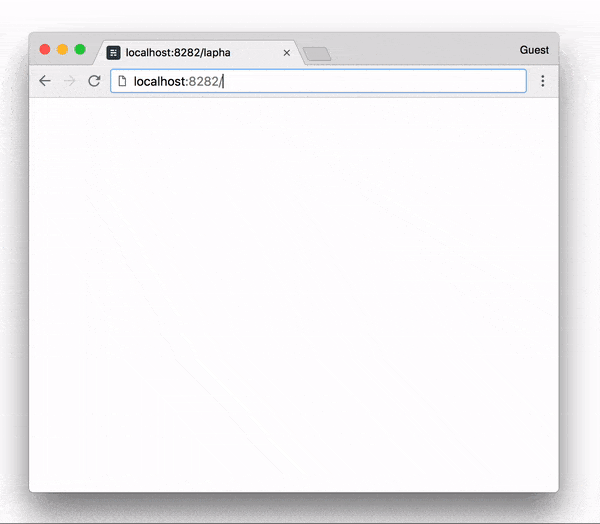
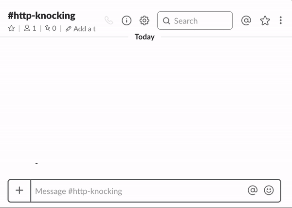
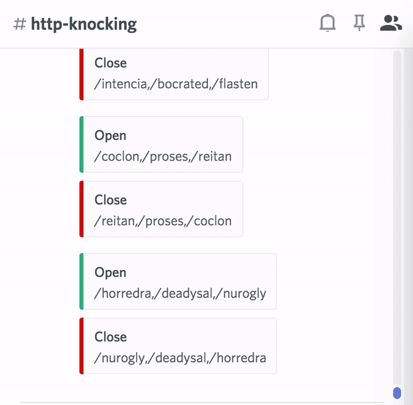

# http-knocking

[](https://www.npmjs.com/package/http-knocking)
 [](https://travis-ci.com/nwtgck/http-knocking) [](https://circleci.com/gh/nwtgck/http-knocking) [](https://hub.docker.com/r/nwtgck/http-knocking/) [](https://microbadger.com/images/nwtgck/http-knocking "Get your own image badge on microbadger.com")

HTTP knocking is like port knocking. It hides your server, and allows you to open/close the server by certain knocking.   
In HTTPS communication, knocking is hidden because of encryption unlike port knocking.



## Run with npm

Suppose http://localhost:8181/ is running. The following command runs a http-knocking server on port 8282.

```bash
npm install -g http-knocking
http-knocking --port=8282 --target-host=localhost --target-port=8181 --open-knocking="/alpha,/foxtrot,/lima"
```

In the case of `--open-knocking="/alpha,/foxtrot,/lima"`, you can **open the server** by accessing to

1. <http://localhost:8282/alpha>
1. <http://localhost:8282/foxtrot>
1. <http://localhost:8282/lima>  

Close procedure is the reverse order of open if `--close-knocking` is not specfied.  
Technically, `localhost:8282` is a reverse proxy server to `localhost:8181`.


## Run with Docker Compose

Here is a `docker-compose.yml` to run [Ghost](https://ghost.org/) on http-knocking.

```yaml
version: '3.1'
services:
  http-knocking:
    image: nwtgck/http-knocking:v0.3.1
    ports:
      - '8282:8282'
    depends_on:
      - ghost
    restart: always
    command: --port=8282 --target-host=ghost --target-port=2368 --open-knocking="/alpha,/foxtrot,/lima"
  ghost:
    image: ghost
    restart: always
    expose:
      - "2368"
```

## Options

Here is available options.

```
Options:
  --help                               Show help                       [boolean]
  --version                            Show version number             [boolean]
  --port                               Port of knocking server
                                                             [number] [required]
  --target-host                        Target host to hide   [string] [required]
  --target-port                        Target port to hide[number] [default: 80]
  --open-knocking                      Open-knocking sequence (e.g.
                                       "/alpha,/foxtrot,/lima")         [string]
  --close-knocking                     Close-knocking sequence (e.g.
                                       "/victor,/kilo")                 [string]
  --enable-websocket                   Enable WebSocket proxy   [default: false]
  --auto-close-millis                  Time millis to close automatically
                                                                        [number]
  --open-knocking-max-interval-millis  Time millis to reset open procedure
                                                                        [number]
  --http-request-limit                 Limit of HTTP request            [number]
  --on-upgrade-limit                   Limit of on-upgrade (WebSocket)  [number]
  --enable-fake-nginx                  Enable fake Nginx Internal Server Error
                                       response                 [default: false]
  --fake-nginx-version                 Nginx version in fake Nginx Internal
                                       Server Error response [default: "1.15.2"]
  --enable-empty-response              Enable empty response (NOTE: Not empty
                                       HTTP body)               [default: false]
  --enable-knocking-update             Enable auto knocking-update
                                                                [default: false]
  --knocking-update-interval-sec       Interval millis of auto knocking-update
                                                                 [default: 1800]
  --min-knocking-length                Min knocking length used in auto
                                       knocking-update              [default: 6]
  --max-knocking-length                Max knocking length used in auto
                                       knocking-update              [default: 8]
  --n-knockings                        The number of knocking sequence used in
                                       auto knocking-update         [default: 3]
  --webhook-url                        Webhook URL used in auto knocking-update
                                                                        [string]
  --webhook-template-path              Webhook template file path used in auto
                                       knocking-update                  [string]
```

 `--auto-close-millis` option makes your server more secure because it closes automatically by time.  
 `--open-knocking-max-interval-millis` option also makes your server more secure because it resets open procedure by time.  
 `--http-request-limit` restricts the number of HTTP requests after knocking server opening.  
 `--on-upgrade-limit` restricts the number of on-upgrade (WebSocket) after knocking server opening.  
 `--enable-fake-nginx` option fakes server response like "Nginx Internal Server Error" when the knocking server is closed.    
 `--fake-nginx-version` option specifies Nginx version used in fake "Internal Server Error" response.      
 `--enable-empty-response` option changes a knocking server response to be empty when the knocking server is closed

 ## Auto Knocking-Update

 To get more secure, `--enable-knocking-update` option updates knocking-sequences regularly and notifies new sequences via Webhook. You can use **any Webhook-supported services**.

Here is a demo to notify to [Slack](https://slack.com).

 

Here is a demo to notify to [Discord](https://discordapp.com).

 
 
Templates of JSON notified to the services are located at  
- [webhook-templates/slack_template.json](webhook-templates/slack_template.json)
- [webhook-templates/discord_template.json](webhook-templates/discord_template.json)

The following options are required to enable auto knocking-update.
* `--enable-knocking-update`
* `--webhook-url=https://...`
* `--webhook-template-path=./path/to/webhook/template`

### Fake English words

Fake English words used in auto knocking-update are generated by [fakelish](https://github.com/nwtgck/fakelish-npm).
